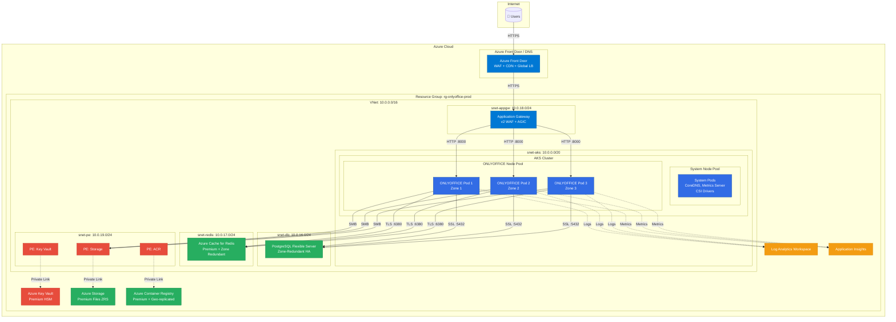
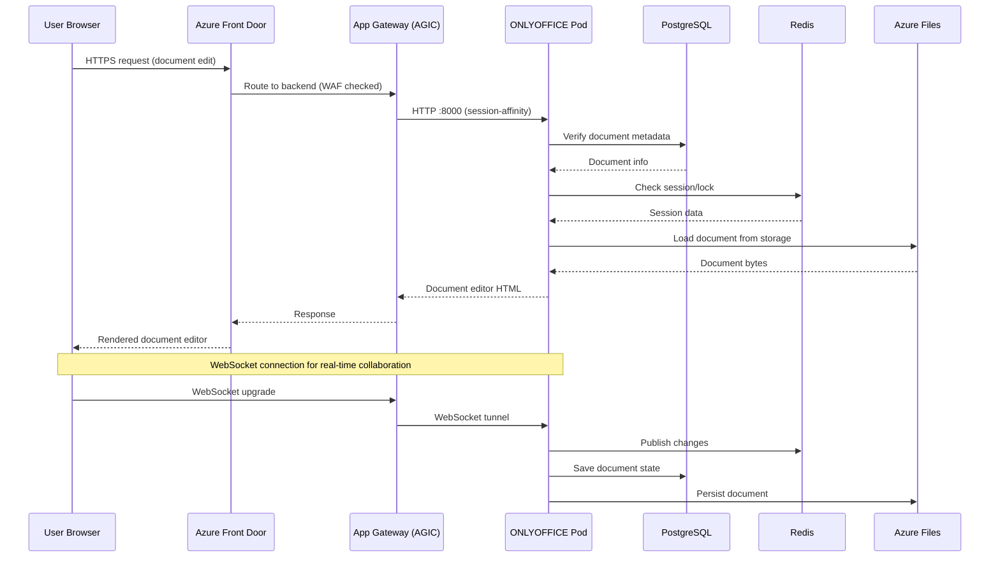
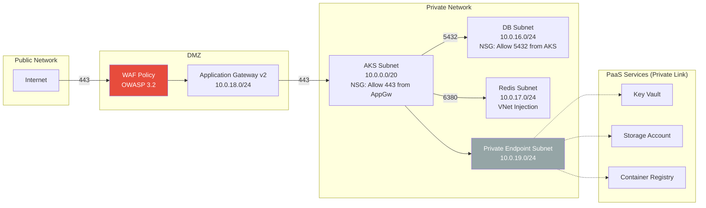
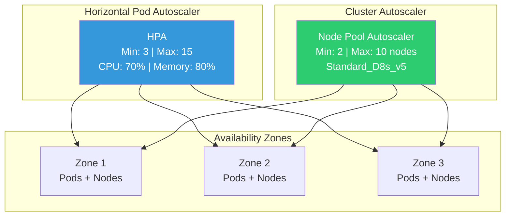

# Architecture Overview

## ONLYOFFICE Document Server on Azure AKS

### High-Level Architecture

```mermaid
graph TB
    subgraph "Internet"
        Users[("👤 Users")]
    end

    subgraph "Azure Cloud"
        subgraph "Azure Front Door / DNS"
            AFD["Azure Front Door<br/>WAF + CDN + Global LB"]
        end

        subgraph "Resource Group: rg-onlyoffice-prod"
            subgraph "VNet: 10.0.0.0/16"
                subgraph "snet-appgw: 10.0.18.0/24"
                    AGIC["Application Gateway<br/>v2 WAF + AGIC"]
                end

                subgraph "snet-aks: 10.0.0.0/20"
                    subgraph "AKS Cluster"
                        subgraph "System Node Pool"
                            SYS["System Pods<br/>CoreDNS, Metrics Server<br/>CSI Drivers"]
                        end
                        subgraph "ONLYOFFICE Node Pool"
                            OO1["ONLYOFFICE Pod 1<br/>Zone 1"]
                            OO2["ONLYOFFICE Pod 2<br/>Zone 2"]
                            OO3["ONLYOFFICE Pod 3<br/>Zone 3"]
                        end
                    end
                end

                subgraph "snet-db: 10.0.16.0/24"
                    PSQL["PostgreSQL Flexible Server<br/>Zone-Redundant HA"]
                end

                subgraph "snet-redis: 10.0.17.0/24"
                    REDIS["Azure Cache for Redis<br/>Premium + Zone Redundant"]
                end

                subgraph "snet-pe: 10.0.19.0/24"
                    PE_KV["PE: Key Vault"]
                    PE_ST["PE: Storage"]
                    PE_ACR["PE: ACR"]
                end
            end

            KV["Azure Key Vault<br/>Premium HSM"]
            ST["Azure Storage<br/>Premium Files ZRS"]
            ACR["Azure Container Registry<br/>Premium + Geo-replicated"]
            LOG["Log Analytics Workspace"]
            AI["Application Insights"]
        end
    end

    Users -->|"HTTPS"| AFD
    AFD -->|"HTTPS"| AGIC
    AGIC -->|"HTTP :8000"| OO1 & OO2 & OO3
    OO1 & OO2 & OO3 -->|"SSL :5432"| PSQL
    OO1 & OO2 & OO3 -->|"TLS :6380"| REDIS
    OO1 & OO2 & OO3 -->|"SMB"| PE_ST
    PE_ST -.->|"Private Link"| ST
    PE_KV -.->|"Private Link"| KV
    PE_ACR -.->|"Private Link"| ACR
    OO1 & OO2 & OO3 -.->|"Logs"| LOG
    OO1 & OO2 & OO3 -.->|"Metrics"| AI

    classDef azure fill:#0078d4,color:#fff,stroke:#005a9e
    classDef pod fill:#326ce5,color:#fff,stroke:#1a4f9e
    classDef security fill:#e74c3c,color:#fff,stroke:#c0392b
    classDef storage fill:#27ae60,color:#fff,stroke:#1e8449
    classDef monitor fill:#f39c12,color:#fff,stroke:#d68910

    class AFD,AGIC azure
    class OO1,OO2,OO3,SYS pod
    class KV,PE_KV,PE_ST,PE_ACR security
    class PSQL,REDIS,ST,ACR storage
    class LOG,AI monitor
```

### Data Flow

```mermaid
sequenceDiagram
    participant U as User Browser
    participant FD as Azure Front Door
    participant AG as App Gateway (AGIC)
    participant OO as ONLYOFFICE Pod
    participant PG as PostgreSQL
    participant R as Redis
    participant S as Azure Files

    U->>FD: HTTPS request (document edit)
    FD->>AG: Route to backend (WAF checked)
    AG->>OO: HTTP :8000 (session-affinity)
    
    OO->>PG: Verify document metadata
    PG-->>OO: Document info
    
    OO->>R: Check session/lock
    R-->>OO: Session data
    
    OO->>S: Load document from storage
    S-->>OO: Document bytes
    
    OO-->>AG: Document editor HTML
    AG-->>FD: Response
    FD-->>U: Rendered document editor

    Note over U,OO: WebSocket connection for real-time collaboration
    U->>AG: WebSocket upgrade
    AG->>OO: WebSocket tunnel
    OO->>R: Publish changes
    OO->>PG: Save document state
    OO->>S: Persist document
```

### Network Architecture

```mermaid
graph LR
    subgraph "Public Network"
        IN["Internet"]
    end

    subgraph "DMZ"
        WAF["WAF Policy<br/>OWASP 3.2"]
        APPGW["Application Gateway v2<br/>10.0.18.0/24"]
    end

    subgraph "Private Network"
        AKS["AKS Subnet<br/>10.0.0.0/20<br/>NSG: Allow 443 from AppGw"]
        DB["DB Subnet<br/>10.0.16.0/24<br/>NSG: Allow 5432 from AKS"]
        CACHE["Redis Subnet<br/>10.0.17.0/24<br/>VNet Injection"]
        PE["Private Endpoint Subnet<br/>10.0.19.0/24"]
    end

    subgraph "PaaS Services (Private Link)"
        KV2["Key Vault"]
        ST2["Storage Account"]
        ACR2["Container Registry"]
    end

    IN -->|"443"| WAF
    WAF --> APPGW
    APPGW -->|"443"| AKS
    AKS -->|"5432"| DB
    AKS -->|"6380"| CACHE
    AKS --> PE
    PE -.-> KV2 & ST2 & ACR2

    style WAF fill:#e74c3c,color:#fff
    style PE fill:#95a5a6,color:#fff
```

### CI/CD Pipeline

```mermaid
graph LR
    subgraph "Development"
        DEV["Developer"]
        PR["Pull Request"]
    end

    subgraph "CI Pipeline"
        FMT["terraform fmt"]
        VAL["terraform validate"]
        LINT["TFLint"]
        SEC["Checkov + Trivy"]
        HELM["Helm lint"]
        PLAN["terraform plan"]
    end

    subgraph "CD Pipeline"
        APPLY["terraform apply"]
        DEPLOY["helm upgrade"]
        VERIFY["kubectl verify"]
        SMOKE["Smoke tests"]
    end

    subgraph "Azure"
        AKS2["AKS Cluster"]
    end

    DEV -->|"push"| PR
    PR --> FMT --> VAL --> LINT --> SEC --> HELM --> PLAN
    PLAN -->|"merge to main"| APPLY
    APPLY --> DEPLOY --> VERIFY --> SMOKE
    SMOKE --> AKS2

    style SEC fill:#e74c3c,color:#fff
    style SMOKE fill:#27ae60,color:#fff
```

### Scaling Architecture

```mermaid
graph TB
    subgraph "Horizontal Pod Autoscaler"
        HPA["HPA<br/>Min: 3 | Max: 15<br/>CPU: 70% | Memory: 80%"]
    end

    subgraph "Cluster Autoscaler"
        CA["Node Pool Autoscaler<br/>Min: 2 | Max: 10 nodes<br/>Standard_D8s_v5"]
    end

    subgraph "Availability Zones"
        Z1["Zone 1<br/>Pods + Nodes"]
        Z2["Zone 2<br/>Pods + Nodes"]
        Z3["Zone 3<br/>Pods + Nodes"]
    end

    HPA --> Z1 & Z2 & Z3
    CA --> Z1 & Z2 & Z3

    style HPA fill:#3498db,color:#fff
    style CA fill:#2ecc71,color:#fff
```
